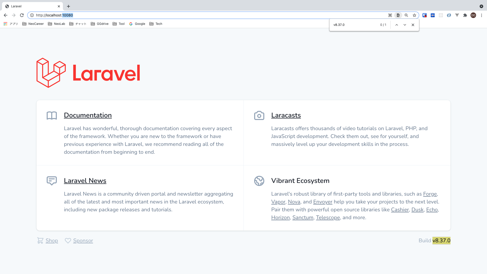

# Vue2 Laravel8 Stripe shopping cart


[](https://github.com/tquangdo/vue2-laravel8-stripe-shopping-cart/issues/new)

## localdeploy

- `docker-compose up -d --build`
- `docker-compose exec app bash`
- `[app] $ composer install`
- `[app] $ cp .env.example .env`
- `[app] $ php artisan key:generate`
- browser: access "localhost:10080"
- `[app] $ php artisan migrate`



## connect DB

1. in CLI
- `docker-compose exec db bash -c 'mysql -u${MYSQL_USER} -p${MYSQL_PASSWORD} ${MYSQL_DATABASE}'`
- `mysql> show tables;`
2. by tools (MySQL Workbench)
- username: `root`
- pw: `secret`
- port: `33060`

## output log

- edit in `backend/.env`: `LOG_CHANNEL=stderr`
- edit in `backend/routes/web.php`:
```php
Route::get('/', function () {
    logger('welcome route.');
    return view('welcome');
});
```
- `docker-compose logs -f app`
- browser: access "localhost:10080" => will see 'welcome route.' in log console

## check versions

1. PHP: `[app] # php -v`
>(PHP info: `[app] # php -m`)
2. composer: `[app] # composer -v`
3. laravel: `[app] $ php artisan -v`
