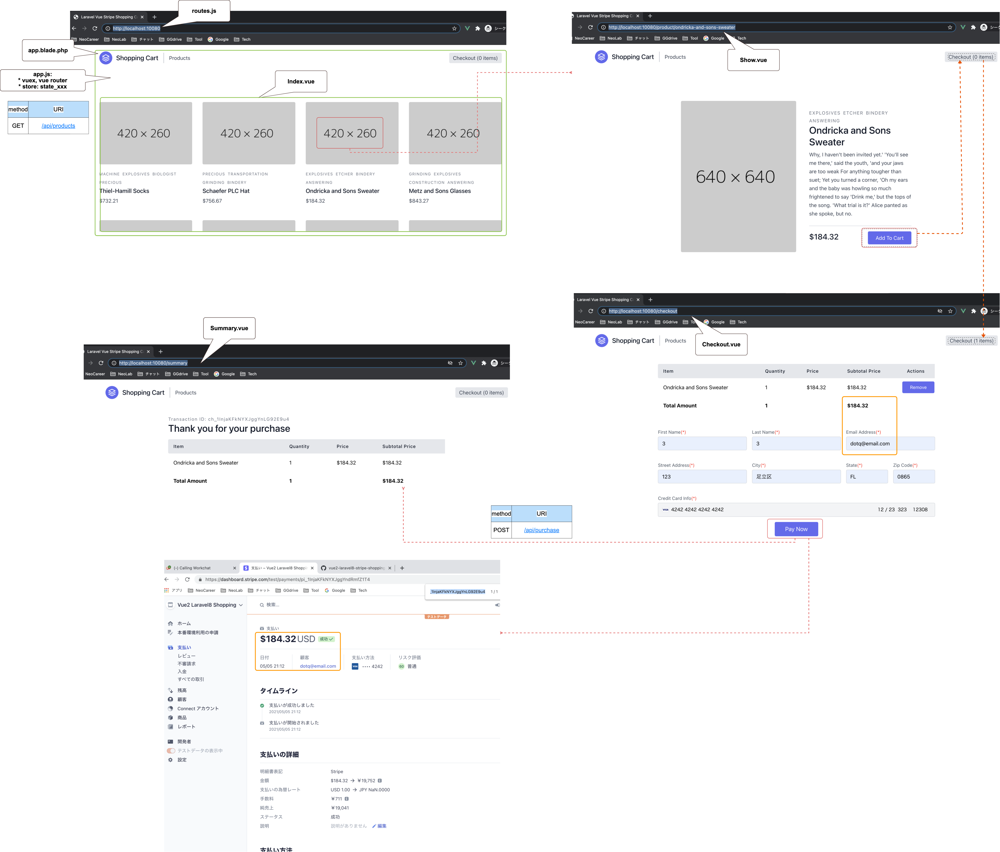

# Vue2 Laravel8 Stripe shopping cart


[](https://github.com/tquangdo/vue2-laravel8-stripe-shopping-cart/issues/new)

## reference


## check versions
1. PHP: `[php] # php -v`
>(PHP info: `[php] # php -m`)
2. composer: `[php] # composer -v`
3. laravel: `[php] $ php artisan -v`

## localdeploy (use clone repo)
1. ### BE
    - `docker-compose up -d --build`
    - `docker-compose exec php bash`
    - `[php] $ composer install`
    - `[php] $ cp .env.example .env`
    - fill `STRIPE_KEY` & `STRIPE_SECRET` in `.env`
    
    - `[php] $ php artisan key:generate`
1. ### FE
    - `npm i`
    - `npm run watch`
    - access on browser: `http://localhost:10080` (port `10080` in `docker-compose.yml`)
    

## localdeploy (create new proj)
1. ### BE MVC
    1. #### model
        - `php artisan make:model Product<Category><Order> -m`
        - => create products<categories><orders> table
        - copy paste content into all Model/*.php (include `backend/app/Models/User.php`)
        - `composer require laravel/cashier` (stripe)
        > https://laravel.com/docs/8.x/billing
    1. #### table "order_product" & "category_product"
        - `php artisan make:migration create_order<category>_product_table --table=order<category>_product`
        - => NOT create table yet! (just create empty file `xxx_create_order<category>_product_table.php`)
        - copy paste content into `xxx_table.php` (do NOT forget `xxx_create_users_table.php`) > `php artisan migrate(:refresh)`
        
        > ":refresh" will delete all fake data => need run again `php artisan db:seed`!!!
        ---
        
    1. #### test to create 1 random user (NOT insert into table yet!)
        ```shell
        php artisan tinker
        >>> $user = App\Models\User::factory()->make();
        => ...
        >>> $user
        =>
        App\Models\User {#3534
            name: "Mr. Barney Ward II",
            email: "arne.ruecker@example.org",
            email_verified_at: "2022-04-01 03:51:09",
            #password: "$2y$10$92IXUNpkjO0rOQ5byMi.Ye4oKoEa3Ro9llC/.og/at2.uheWG/igi",
            #remember_token: "EEcIl0Gw7b",
        }
        ```
    1. #### factory
        - `php artisan make:factory Product<Category><Order>Factory --model=Product<Category><Order> -m`
        - => create `database/factories/Product<Category><Order>Factory.php`
        - copy paste content into `*Factory.php` (do NOT forget `UserFactory.php`)
    1. #### seeder
        - `php artisan make:seeder User<Product>Seeder`
        - copy paste content into `backend/database/seeders/DatabaseSeeder.php` (include `User<Product>Seeder`)
        - `php artisan db:seed( --class=DatabaseSeeder)` => insert data into tables
        - A/ check by MySQL:
        ```shell
        mysql> select * from products\G
        *************************** 1. row ***************************
                id: 1
            name: Gutmann LLC Socks
            slug: gutmann-llc-socks
        description: No room!' they cried out when they saw her, they hurried back to the Duchess: 'what a clear way you can;--but I must go and live in that poky little house, and wondering whether she could do to come down the chimney, has he?' said Alice very politely; but she heard it say to itself, half to herself, as usual. 'Come.
            price: 26269
        created_at: 2022-04-02 15:02:09
        updated_at: 2022-04-02 15:02:09
        ...
        ```
        - B/ check by tinker:
        - `php artisan tinker`
        - `>>> App\Models\Product::all();`
        OR
        - `>>> App\Models\Product::with('categories')->get();`
    1. #### controller
        - `php artisan make:controller Api/Product<User>Controller`
    1. #### routes
        - copy paste content into `backend/routes/api.php & web.php`
1. ### test API
    - `php artisan serve`
    1. #### GET
        - access `localhost:8000/api/products` on browser => will see JSON
    1. #### POST
        - `localhost:8000/api/purchase`
        - click "Pay Now" (stripe) in `backend/app/Http/Controllers/Api/UserController.php > routeApiPurchase()` => NO need to take time to test API!!!
1. ### FE
    - copy paste content into `backend/resources`
    - copy paste content into `backend/webpack.mix.js`
    > ⚠️⚠️⚠️ IMPORTANT ⚠️⚠️⚠️!!!
    > - laravel-mix ver 5: repo
    > - laravel-mix ver 6: `mix.js('resources/js/app.js', 'public/js')` -> `mix.js('resources/js/app.js', 'public/js').vue()`
    - `backend$ npm i vue vuex vue-router tailwindcss @stripe/stripe-js`
    - if ERR with `tailwindcss`: edit `backend/package.json >  "tailwindcss": "npm:@tailwindcss/postcss7-compat@^2.0.2",`
    - `npm i`
    - `npm run watch`

## connect DB

1. ### in CLI
    - `docker-compose exec db bash -c 'mysql -u${MYSQL_USER} -p${MYSQL_PASSWORD} ${MYSQL_DATABASE}'`
    ```shell
    mysql> show tables;
    =>
    +-------------------------+
    | Tables_in_laravel_local |
    +-------------------------+
    | categories              |
    | category_product        |
    | failed_jobs             |
    | migrations              |
    | order_product           |
    | orders                  |
    | password_resets         |
    | personal_access_tokens  |
    | products                |
    | users                   |
    +-------------------------+
    10 rows in set (0.00 sec)
    ```
1. ### by tools (MySQL Workbench)
    - username: `root`
    - pw: `secret`
    - port: `33060`
1. ### by tinker:
    ```shell
    php artisan tinker
    >>> config('database')
    => [
        "default" => "mysql",
        "connections" => [
        "sqlite" => [
            "driver" => "sqlite",
            "url" => null,
            "database" => "laravel_local",
            "prefix" => "",
            "foreign_key_constraints" => true,
        ],
        "mysql" => [
            "driver" => "mysql",
            "url" => null,
            "host" => "127.0.0.1",
            "port" => "3306",
            "database" => "laravel_local",
            "username" => "root",
            "password" => "secret",
            "unix_socket" => "",
            "charset" => "utf8mb4",
            "collation" => "utf8mb4_unicode_ci",
            "prefix" => "",
            "prefix_indexes" => true,
            "strict" => true,
            "engine" => null,
            "options" => [],
        ],
        "pgsql" => [...]
    ```
