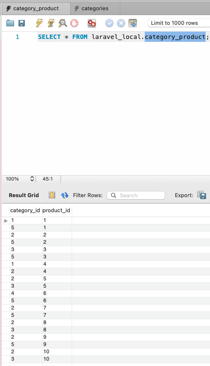
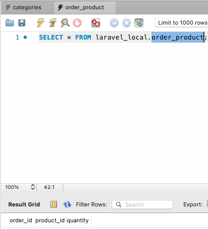
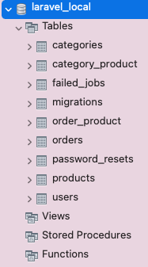

# BACKEND

## Run

- `backend/package.json: "tailwindcss": "npm:@tailwindcss/postcss7-compat@^2.0.2",`
- `npm i`
- `npm i vue vuex vue-router`
- `npm run watch`
- access on browser: `http://localhost:10080`

## MVC

- `php artisan make:model Product<Category><Order> -m`
- `php artisan make:migration create_order<category>_product_table --table=order<category>_product`

- `php artisan tinker`
- `>>> $user = App\Models\User::factory()->make();`
- `php artisan make:factory Product<Category>Factory --model=Product<Category>`
- `php artisan migrate`
- `php artisan db:seed`
- `php artisan tinker`
- `>>> App\Models\Product::all();`
OR
- `>>> App\Models\Product::with('categories')->get();`
- `php artisan make:controller Api/Product<User>Controller`

## Stripe

https://laravel.com/docs/8.x/billing
- `composer require laravel/cashier`

- `backend$ npm i @stripe/stripe-js`

## connect DB

