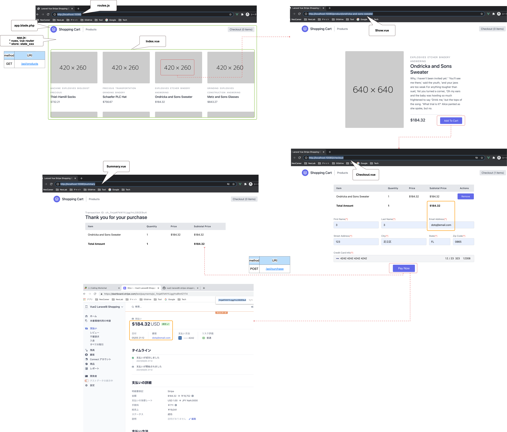

# BACKEND

## Install

- `docker-compose exec app bash`
- `composer require laravel/sanctum`
- `php artisan vendor:publish --provider="Laravel\Sanctum\SanctumServiceProvider"`
- `composer require laravel/jetstream`
- `php artisan jetstream:install inertia`
- `cd backend`
- `backend % npm i`
- `php artisan vendor:publish --tag=jetstream-views`
- `backend % npm run hot`

## Run

- access on browser: `http://localhost`

## MVC

- `php artisan make:model Product/Category/Order -m`
- `php artisan make:migration create_order/category_product_table --table=order/category_product`
- `php artisan tinker`
- `>>> $user = App\Models\User::factory()->make();`
- `php artisan make:factory Product/CategoryFactory --model=Product/Category`
- `php artisan migrate`
- `php artisan db:seed`
- `php artisan tinker`
- `>>> App\Models\Product::all();`
OR
- `>>> App\Models\Product::with('categories')->get();`

## Pusher

- `composer require pusher/pusher-php-server "~4.0"`
- `backend % npm i --save laravel-echo pusher-js`
- `php artisan event:generate`
>clear cache
- `php artisan optimize`
- `php artisan queue:work`
